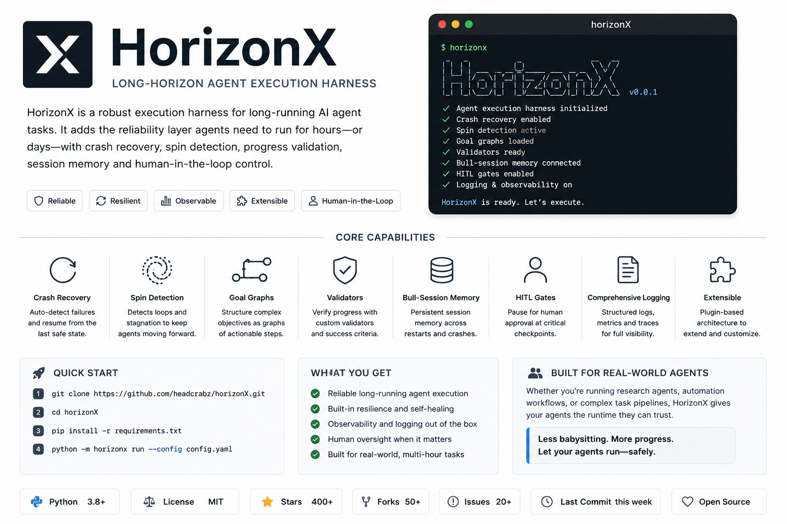

# HorizonX

<p align="center">
  
</p>

**Alpha research preview of a vendor-neutral control plane for long-horizon agent tasks.**

HorizonX coordinates Claude Code, Codex, OpenHands, and custom agents around durable run state,
goal graphs, validation, resource policies, and operator controls. The repository contains tested
building blocks for those capabilities, but several end-to-end guarantees are still being
hardened. It is suitable for local evaluation and development—not unattended or production use.

[](https://github.com/headcrabz/horizonX/actions)
[](LICENSE)
[](https://www.python.org/)
[](tests/)

---

## What it does

HorizonX is not an agent. It is an experimental runtime layer around existing agent harnesses.

The current alpha includes:

- **Durable records** — SQLite stores runs, sessions, steps, validations, HITL records, and usage.
  Goal persistence is authoritative and run-scoped; exact crash-point recovery is under hardening.
- **Spin-analysis components** — seven detectors cover repetition, oscillation, plateaus, and
  cross-session stagnation. Universal invocation and response semantics are not yet guaranteed.
- **Resource-policy components** — token, cost, time, and workspace-budget models exist. Uniform
  enforcement across all strategies and providers is under hardening.
- **Knowledge components** — FTS5 knowledge storage and Markdown handoff sync exist as modules.
  Automatic cross-run sync and prompt injection are not yet wired into the production run path.
- **Goal graphs and validators** — DAG planning and six validator types are implemented. Database
  recovery, a complete evidence contract, and unattended operation are under hardening.
- **Eight strategy modules** — single, sequential, pair, tree, self-critique, decomposition,
  monitor, and ralph. They are experimental until they share one verified execution lifecycle.
- **Operator and observability components** — Slack HITL, dashboard SSE, and CLI watch exist.
  Durable commands, real cancellation, authenticated callbacks, and event replay are planned.

See the [support matrix](#project-status) before relying on a capability.

---

## Quick start

Prerequisites: Python 3.11+ and one supported agent CLI. This repository is not yet
published as a stable package, so install it from source:

```bash
git clone https://github.com/headcrabz/horizonX.git
cd horizonX
python3.11 -m venv .venv
source .venv/bin/activate
python -m pip install -e .

# Confirm the CLI is available
horizonx --help
```

Install and authenticate one of the [supported agent harnesses](#agent-harness-setup), then run
the smallest example:

```bash
horizonx run examples/demo_word_counter/task.yaml

# Inspect the run ID and persisted status
horizonx list
horizonx show <run-id>
```

To run against an existing Git repository, pass its local path. HorizonX checks out the requested
ref into an isolated worktree and leaves the source checkout unchanged:

```bash
horizonx run path/to/task.yaml --repo . --ref HEAD
```

By default, orchestration state is written to `./horizonx.db`. From-scratch runs use
`./horizonx-workspaces/`; local repository runs use a hidden sibling directory so the source tree
does not become dirty. The CLI prints the exact run ID, status, and workspace path. Keep the
database on a local filesystem and use one HorizonX process. To choose explicit locations, use
`--db path/to/horizonx.db` before the command and `--workspace-root` after `run`.

Optional operator views:

```bash
# Follow a run from another terminal
horizonx watch <run-id>

# Install and launch the dashboard
pip install -e ".[dashboard]"
horizonx serve
```

Resume is experimental and currently operates at supported session boundaries:
`horizonx run task.yaml --resume <run-id>`.

The checked-in Compose file is currently a development stub, not a supported quick start. Image
packaging, container binding, and health checks remain under hardening.

### Examples to try

| Example | What it demonstrates | Command |
|---|---|---|
| Word counter | One bounded agent session with a final test gate | `horizonx run examples/demo_word_counter/` |
| Self critique | Implementer/reviewer iterations with an acceptance score | `horizonx run examples/demo_refactor/` |
| Coding | A multi-session sequential goal graph | `horizonx run examples/coding/` |

Examples can invoke paid agent/model APIs. Read each `task.yaml` and its resource limits before
running it. The longer examples describe intended evaluation scenarios; they are not production
recipes.

---

## Task definition

```yaml
id: refactor-auth-001
name: Refactor authentication to JWT
prompt: |
  Replace session-cookie auth with JWT tokens.
  Use RS256 signing. Update all protected routes.
  All existing tests must continue to pass.

strategy:
  kind: sequential
  config:
    max_attempts_per_goal: 3
    git_commit_each_session: true

agent:
  type: claude_code
  model: claude-opus-4-8

# Optional for tasks that operate on an existing repository.
# Use `url` instead of `path` to clone a remote source.
repository:
  path: .
  ref: HEAD
  branch: horizonx/jwt-refactor
  submodules: false

environment:
  type: local
  setup_commands:
    - python -m venv .venv
    - .venv/bin/pip install -r requirements.txt
  inherit_env: [PATH, HOME, ANTHROPIC_API_KEY]

milestone_validators:
  - id: tests_pass
    type: test_suite
    runs: after_every_session
    on_fail: pause_for_hitl
    config:
      command: pytest tests/ -q

hitl:
  notification_type: slack
  notification_target: "#eng-alerts"
  timeout_minutes: 30
  escalation_action: approve

resources:
  max_total_usd: 5.0
  max_total_tokens: 500000
```

### How goal graphs are created

Choose graph behavior through `strategy.kind` rather than hand-editing runtime state:

- `single`, `pair`, `tree`, `self_critique`, `monitor`, and `ralph` control their own loops and do
  not require a user-authored goal graph.
- `sequential` starts with an initializer session that creates `goals.json`, then executes one
  verifiable leaf goal per session.
- `decomposition` asks a planning model for a structured graph before starting executor sessions.

For graph strategies, every leaf should fit in one session, state a concrete deliverable, and have
binary verification criteria. Dependencies must point to existing nodes and the graph must remain
acyclic. SQLite becomes authoritative after graph creation; workspace `goals.json` is an atomic,
human-readable projection for inspection and handoff. On resume or fork, HorizonX loads the
persisted graph instead of silently starting a new plan.

```text
g.root  Deliver the feature
├── g.api    Implement endpoint     [API tests pass]
├── g.auth   Add authorization      [unauthorized requests fail]
└── g.e2e    Verify complete flow   [depends on g.api and g.auth]
```

See [the goal-graph design and schema](docs/LONG_HORIZON_AGENT.md#12-goal-graph--durable-hierarchical-plan)
for node fields, validator inheritance, and transition rules.

---

## Execution strategies

| Strategy | Use when |
|---|---|
| `single` | Quick tasks under ~30 steps |
| `sequential` | Feature builds, migrations — one sub-goal per session with filesystem handoffs |
| `pair` | Quality-critical output — driver codes, navigator reviews each step |
| `self_critique` | Code quality — agent critiques its own output before marking done |
| `decomposition` | Complex tasks — LLM decomposes into sub-tasks first |
| `tree` | Ambiguous problems — parallel branches, best result wins |
| `monitor` | Long-lived watching — fires when conditions trigger |
| `ralph` | Iterative optimization — time-boxed loops with metric-driven retention |

---

## Spin detection layers

Loops that the agent can't detect itself are caught by HorizonX automatically:

| Layer | Catches |
|---|---|
| `ExactLoop` | Identical tool calls repeated ≥ N times |
| `BucketedHash` | Semantically similar calls with minor argument variation |
| `EditRevert` | A→B→A→B file flip-flop oscillation |
| `ToolThrashing` | Same tool dominating with no new outputs (idempotent reads) or same mutating args |
| `ScorePlateau` | Validator scores flat across N sessions — no real progress |
| `SemanticProgress` | LLM judge: is the agent actually advancing on the stated goal? |
| `CrossSession` | Multiple sessions completed but zero goal nodes transitioned to DONE |

Soft-threshold triggers a diagnostic injection. Hard-threshold terminates the session and notifies the operator.

---

## Budget governance

```yaml
resources:
  max_total_usd: 10.0          # hard stop
  max_total_tokens: 1_000_000

workspace:
  workspace_id: my-project
  daily_budget_usd: 25.0       # across all runs today
```

- Charges are tracked from real token counts in agent stream events
- Slack alert fires at 75% via `asyncio.create_task` (non-blocking)
- Cost velocity detector fires when $/min rate doubles twice in succession
- Pre-flight check blocks new runs when workspace daily budget is exhausted

---

## Knowledge and handoff components

HorizonX includes an experimental FTS5 knowledge store and Markdown handoff format. A knowledge
file looks like this:

```markdown
# workspace/knowledge/auth.md
---
tags: [jwt, security, python]
---
PyJWT 2.8+ requires explicit algorithm parameter in decode().
Use: jwt.decode(token, key, algorithms=["HS256"])
```

The storage, search, and handoff modules have focused tests, but automatic indexing, retrieval, and
prompt injection are not yet connected across every normal run path. Treat this as an extension
surface, not a durable cross-run memory guarantee in the current alpha.

---

## Agent harness setup

HorizonX ships drivers for four agents. Each needs its own binary or API key:

### Claude Code (default)
```bash
# Install Claude Code CLI
npm install -g @anthropic-ai/claude-code

# Authenticate (subscription or API key)
claude /login
# OR
export ANTHROPIC_API_KEY=sk-ant-...
```
```yaml
agent:
  type: claude_code
  model: claude-opus-4-8        # or claude-sonnet-4-6, claude-haiku-4-5
  extra:
    permission_mode: bypassPermissions   # acceptEdits | auto | bypassPermissions
    max_budget_usd: 2.0                  # native claude budget cap (optional)
```

### Codex (OpenAI)
```bash
npm install -g @openai/codex
export OPENAI_API_KEY=sk-...
```
```yaml
agent:
  type: codex
  model: codex-mini-latest      # or o4-mini
```

### OpenHands
```bash
pip install openhands-ai
export ANTHROPIC_API_KEY=sk-ant-...   # or OPENAI_API_KEY
```
```yaml
agent:
  type: openhands
  model: claude-opus-4-8
```

### Custom / SDK agent (no binary needed)
```python
from pathlib import Path
from horizonx.core.types import Step, StepType

async def my_agent(prompt: str, workspace_path: Path):
    # yield Step objects as your agent works
    yield Step(session_id="", sequence=0, type=StepType.THOUGHT,
               content={"text": "Starting task..."})
    # ... do work, yield more steps ...

# Register inline:
task = Task(agent=AgentConfig(type="sdk", extra={"callable": my_agent}))
```

Or ship as a pip package with an entry-point (see [CONTRIBUTING.md](CONTRIBUTING.md)).

---

## Pluggable architecture

All extension points use Python entry-points — ship a pip package and it works:

```toml
# Your plugin's pyproject.toml
[project.entry-points."horizonx.agents"]
my_agent = "my_package.agents:MyAgent"

[project.entry-points."horizonx.strategies"]
my_strategy = "my_package.strategies:MyStrategy"

[project.entry-points."horizonx.validators"]
my_gate = "my_package.validators:MyGate"
```

For API-based agents (no subprocess needed):

```python
async def my_agent_fn(prompt: str, workspace_path: Path):
    # yield Step objects as your agent works
    yield Step(session_id="", sequence=0, type=StepType.THOUGHT, content={"text": "..."})

task = Task(agent=AgentConfig(type="sdk", extra={"callable": my_agent_fn}))
```

---

## Target architecture

This diagram is the intended converged lifecycle. In the alpha, strategy modules still invoke
parts of the lifecycle differently; the [support matrix](#project-status) is authoritative.

```
Task (YAML / Python)
  → Runtime.run()
    → Budget pre-check (workspace daily limit)
    → Strategy.execute()         (decides session loop shape)
      → SessionManager           (composes prompt + knowledge injection)
        → Agent.run_session()    (spawns subprocess, yields Steps)
          → TrajectoryRecorder   (persists Steps to SQLite + JSONL)
        → SpinDetector           (7 layers, in-session + cross-session)
        → Runtime.run_validators (gates: continue / pause / abort)
        → ResourceGovernor       (charges tokens/cost, checks thresholds)
        → KnowledgeHandoffDir    (indexes knowledge/*.md to FTS5)
    → EventBus                   (SSE → dashboard / CLI watch / Slack)
    → SqliteStore                (local durable state; recovery hardening in progress)
```

---

## Development

```bash
# Install with all extras
pip install -e ".[dev,dashboard,slack]"

# Run tests
pytest

# Lint
ruff check horizonx/ tests/

# Type check
mypy horizonx/ --ignore-missing-imports
```

See [CONTRIBUTING.md](CONTRIBUTING.md) for how to write custom agents, strategies, and validators.

---

## Project status

HorizonX is an **alpha research preview**. “Implemented” below means the component exists and has
focused tests; it does not imply a verified production guarantee.

| Capability | Alpha status | Current boundary |
|---|---|---|
| Python models, registries, and plugin entry points | Implemented | Third-party agent and validator names are supported; third-party strategy names are blocked by the current config schema. |
| CLI execution, inspection, dashboard, and database maintenance | Implemented subset | `run`, `show`, `list`, `watch`, `fork`, `export`, `serve`, `doctor`, `backup`, `restore`, and `checkpoint` are available; broader operator workflows are planned. |
| SQLite orchestration persistence | Implemented, local-only | Run-scoped goal identity, migrations, foreign keys, bounded contention, integrity checks, backup, restore, and atomic goal transitions are implemented. Use one local HorizonX daemon and keep the database on a local filesystem. |
| Claude Code, Codex, OpenHands, custom, and SDK drivers | Experimental | CLI transports exist; structured native transports, capability negotiation, and cross-provider parity are not verified. |
| Eight execution strategy modules | Experimental | Every built-in yields a typed terminal outcome and shares final-validator semantics; attempt, cleanup, budget, and recovery paths still need one executor. |
| Goal graph and six validator types | Experimental | SQLite is authoritative and `goals.json` is an atomic projection; completion rejection no longer reports a successful run, while evidence calibration still needs hardening. |
| Resume and dashboard pending-run recovery | Under hardening | Resume is session-boundary oriented; a crash can lose provider resume state or strand a pending run. Exact crash-point recovery is not claimed. |
| Seven spin-detection components | Under hardening | The sequential path invokes the combined detector; universal wiring and configured response behavior are not yet verified. |
| Resource governor and usage store | Under hardening | Enforcement and accounting are not uniform across strategies/providers; unknown provider cost must not be interpreted as zero. |
| FTS5 knowledge store and handoff sync | Components only | The store and sync modules are not yet connected to the normal runtime/strategy lifecycle. Automatic cross-run memory is not claimed. |
| Slack HITL and dashboard controls | Under hardening | Durable decisions, authenticated callbacks, restart-safe waits, and process-tree cancellation are not complete. |
| SSE dashboard and JSONL trajectory | Experimental | SSE is in-memory and has no durable cursor/replay guarantee. |
| Local workspace execution | Implemented, local-only | Local paths use contained Git worktrees; clone URLs, refs, optional branches/submodules, setup commands with an environment allowlist, metadata, and safe session-boundary resume are covered. Process containment and exact crash recovery still need hardening. |
| Docker, Podman, and E2B execution | Not supported | Unimplemented backend values are rejected by configuration instead of being silently treated as local execution. |
| Multi-run/multi-worker concurrency | Not supported | The SQLite backend is intentionally single-daemon; durable leases, worker coordination, and a server database are required for distributed execution. |
| Automated verification | Implemented | 405 tests pass on the audited baseline; Ruff and Mypy pass. This is component coverage, not a production certification. |
| Docker distribution | Not yet supported | The Compose file is a development stub; a real image, binding, health, install, and smoke-test path are planned. |

Until the “under hardening” rows have end-to-end recovery and invariant evidence, do not market or
operate HorizonX as a production-grade long-horizon controller.

---

## License

Apache 2.0 — see [LICENSE](LICENSE).

Built by [Anshul Mittal](https://www.linkedin.com/in/anshulnsit/).
